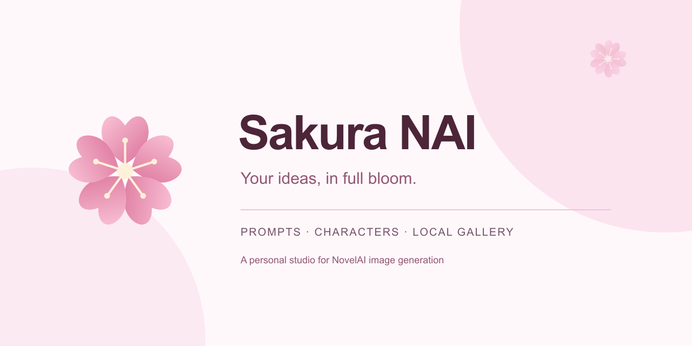

# Sakura NAI

<p align="center">
  
</p>

**简体中文** · [English](README.en.md)

一个以樱花为主题的 NovelAI 绘图工作台。把提示词、角色、生成参数和本地图库放在同一页，让灵感从一句描述开始。

Sakura NAI 可在 Windows 本地运行，也可部署到 Linux 服务器。浏览器直接调用所选的 NovelAI 官方或 Sakura 中转 API，项目自行构造请求、解析图片与流式响应，不依赖 NovelAI SDK。它是独立的非官方客户端，需要对应服务的密钥和账户权限。

## 能做什么

- **以 V5 为主的绘图流程**：支持 NAI Diffusion V5 Full / Curated，并保留 V4.5、V4、Anime V3 和 Furry V3。默认使用 V5 Full。
- **提示词与角色**：正负提示词可分开显示或合并切换；主提示词和角色提示词支持标签建议、一键清空。角色可选 female、male、other，支持自动位置和自定义位置。V5 最多 22 个角色，V4 系列最多 6 个。
- **质量词与负面预设**：选择标准、轻量或关闭质量词，搭配模型对应的负面预设；悬浮可查看完整内容。V5 支持透明背景选项。
- **随手调整参数**：直接编辑步数、Guidance、种子和采样器，一键切换随机种子；支持尺寸、批量生成及参数重置。
- **可选流式预览**：预览随图片比例适配。关闭后保留上一张图片，首张生成时保持空白画布，完成后再展示结果。
- **点数显示**：生成按钮及相应图像工具显示 Anlas 点数；从免费生成切换到付费生成时可弹出一次提醒，设置中可关闭。计算会结合账户状态，最终扣费由 API 服务端决定。
- **图像工作流**：图生图、局部重绘、增强、变体、2 倍放大及图像工具。增强默认显示强度／噪声，高级设置提供 5 档幅度，并支持 V5 Max 档；增强时可继续编辑侧栏参数，点数随有效参数变化；参考图、Vibe Transfer 的可用性随模型变化，当前 V5 不支持 Vibe / 精确参考图。
- **本地图库**：单列浏览、全屏预览、下载 PNG、打包下载、删除撤销。点击历史图片只预览，复用参数需要单独操作；支持从 NovelAI PNG 导入参数。
- **图片与蒙版编辑器**：滚轮围绕鼠标位置缩放，空格／中键拖动视图；圆形／方形笔刷的屏幕大小保持不变，实际落笔宽度与轮廓一致。图片编辑器扩画布后继续保存为图生图；蒙版编辑器扩画布时自动选中新区域，用于扩图。尺寸、图层和蒙版支持撤销／重做，重绘输出分辨率可单独选择。
- **聚焦重绘与 Variety+**：聚焦重绘放大蒙版附近生成细节，再贴回原图，适合修脸和瞳孔；费用按选定的生成分辨率计算。V4.5 等旧模型支持 Variety+，不额外加价，V5 隐藏此选项。
- **普通图片导入**：拖入或选择不含生成参数的 PNG、JPEG、WebP 等图片可作为底图，并保留当前提示词；带 NovelAI 元数据的 PNG 继续恢复生成参数。导入和本地编辑不扣点数。
- **樱花主题**：五瓣樱花标志、樱粉浅色与暖紫深色界面，支持中英文和主题色切换。桌面保留设置区，手机使用抽屉布局。

空白画布提供「樱花中的女孩」「樱巫女（Sakura Miko）」「月下夜樱」三个示例。樱巫女示例使用 `sakura miko, hololive` 角色标签。**点击示例会替换整段正向提示词**，不会自动生成，也不会改动负面提示词和角色设置。

## 本地运行

准备 Bun、Node.js 22 或更高版本，以及支持 IndexedDB 的现代浏览器。下载或克隆本仓库后，在项目根目录执行：

```bash
git clone https://github.com/suzuka-suzuka/Sakura-NAI.git
cd Sakura-NAI
bun install --frozen-lockfile
bun run dev
```

打开 [http://localhost:3000](http://localhost:3000)。连接窗口的「密钥类型」下拉框可选择「Sakura Key」「NovelAI 官方 Key」或「自定义接口」。首次使用默认选择 Sakura Key，已保存的连接恢复原类型；Sakura 配置不可用时默认选择官方 Key。官方与 Sakura 选项自动设置接口地址；自定义接口的地址在「高级连接设置」中填写。切换类型时，当前表单分别保留各类型的密钥，不会把一个服务的密钥自动发给另一个服务。自定义接口应支持本项目调用的 NovelAI API 及浏览器跨域请求。

Sakura 接口地址从项目根目录的 `connection.config.json` 读取：

```json
{
  "sakura": {
    "url": "https://relay.tenshimomone.com/"
  }
}
```

只修改 `sakura.url` 即可更换地址，刷新网页后新选择的 Sakura 连接使用新地址，无需重新构建或重启。已保存的连接保留原地址；需要切换时重新选择 Sakura 并填写对应密钥。此文件只配置公开接口地址，不填写密钥；文件缺失或无效时禁用 Sakura 选项，官方和自定义连接仍可使用。需要把文件放在其他位置时，可通过运行时环境变量 `SAKURA_CONFIG_FILE` 指定配置文件的绝对路径。Windows 启动脚本自动指向项目根目录，Docker Compose 以只读方式挂载该文件。

官方、Sakura 与自定义地址都会通过 `/user/subscription` 验证密钥并加载额度，收到有效账户信息后才显示「已连接」。刷新页面会重新验证；无效或停用的密钥提示重新连接。网络错误、限流、服务异常或不支持账户查询时显示「未验证」，保留连接配置供重试，不会误报连接成功。

如果电脑只有 Node.js，也可以临时通过 npm 调用 Bun 安装依赖：

```bash
npm exec --yes --package=bun -- bun install --frozen-lockfile
npm run dev
```

界面语言会读取浏览器偏好并保存你的选择，可在菜单或连接窗口切换。本文为默认中文说明，英文文档见 [README.en.md](README.en.md)。

### Windows 本地生产版

```powershell
npm run build
.\start-local.cmd
```

启动脚本会准备 standalone 静态资源并监听 **127.0.0.1:3000**。打开 [http://127.0.0.1:3000](http://127.0.0.1:3000)，在终端按 Ctrl + C 停止。修改代码后需要重新构建并重启；开发时使用 `npm run dev` 即可。

更多本机启动说明见 [LOCAL-DEPLOY.md](LOCAL-DEPLOY.md)。

## Linux 服务器部署

仓库提供多阶段 Dockerfile 和 Docker Compose 配置。安装 Docker Engine 与 Compose 插件后，在项目目录运行：

```bash
docker compose up -d --build
docker compose logs -f web
```

默认通过服务器的 **8080** 端口访问，容器内部监听 3000。镜像运行 Next.js standalone 服务，使用非 root 用户并配置健康检查。更新代码后再次执行第一条命令即可重新构建。

绑定自己的域名时，将反向代理指向该端口并启用 HTTPS。可通过 `SITE_URL` 设置页面分享元数据的公开地址：

```bash
SITE_URL=https://sakura.example.com docker compose up -d --build
```

不使用 Docker 时：

```bash
bun install --frozen-lockfile
bun run build
npm run start -- --hostname 127.0.0.1 --port 3000
```

用 systemd 等进程管理工具保持服务运行，再由反向代理接入。此方式仅监听服务器回环地址；Docker Compose 默认映射服务器的 8080 端口。

服务器负责提供网页。**绘图请求仍由用户浏览器发出**，不会自动借用服务器网络代理 NovelAI。部署不需要在服务器环境变量中填写用户 Token。

构建阶段会通过 `next/font` 下载 Google Fonts，因此构建机器需要能访问字体服务；运行时字体随应用一起提供。

## 常用快捷键

| 快捷键 | 操作 |
| --- | --- |
| **Ctrl + K** | 打开命令面板，搜索命令、模型和图库 |
| **Ctrl + Enter** | 使用当前参数开始生成 |
| **Esc** | 关闭当前弹窗、全屏预览或手机抽屉 |
| **[** | 展开／收起手机设置区 |
| **]** | 展开／收起图库 |
| **← / →** | 在全屏预览中切换图片 |
| **+ / − / 0** | 全屏预览中放大／缩小／适应窗口 |

macOS 也支持用 Command 代替 Ctrl。输入提示词时，方括号不会触发面板切换。全屏预览可点击图片外的空白区域退出。

## 数据保存在哪里

| 数据 | 保存或发送位置 |
| --- | --- |
| API Token、连接地址、参数及偏好 | 当前浏览器的 localStorage |
| 已生成图片与生成参数 | 当前浏览器的 IndexedDB |
| 提示词、参考图和绘图请求 | 直接发送至 NovelAI 或你配置的接口地址 |
| 网页与静态资源 | 本地服务或你部署的服务器 |

图库不会自动同步到其他浏览器或设备。更换域名、端口、浏览器会进入不同的存储空间；清理站点数据也会删除本地图库，重要图片请先下载。

升级时沿用历史版本的内部存储键和图库数据库名，以保留已有数据。产品名称与下载文件名已使用 Sakura；内部兼容名称不影响界面品牌。自定义接口会接收你的 Token 和请求内容，请使用你信任的服务。

## 二次开发

技术栈：**Next.js 16、React 19、TypeScript、Tailwind CSS 4、Zustand、IndexedDB**。

| 目录 | 内容 |
| --- | --- |
| `app/` | 页面入口、主题变量、图标与分享元数据 |
| `components/sidebar/` | 提示词、角色、参数和设置菜单 |
| `components/canvas/` | 欢迎页、预览、图像编辑与图像工具 |
| `components/gallery/` | 本地图库及图片操作 |
| `lib/nai/` | 模型参数、请求构造、传输、图片解析和点数计算 |
| `lib/db/` | IndexedDB 图库 |
| `lib/i18n/` | 中英文界面文案 |
| `assets/brand/` | Sakura 樱花 SVG 源文件、图标与 README 横幅 |
| `tests/` | 请求、费用、图片与存储相关测试 |

```bash
npm run lint
npm run typecheck
npm test
npm run build
```

模型适配细节见 [NAI V5 说明](docs/NAI-V5.md)，界面对照与验证记录见 [界面记录](docs/OFFICIAL-UI-AUDIT.md)。各模型的参数、图像工具及流式能力并不完全相同，请以界面支持的选项为准。

## 许可与来源

本项目使用 [MIT License](LICENSE)，基于 [NyaNovel](https://github.com/Nya-Foundation/NyaNovel) 继续开发，保留其原始版权声明。点数计算参考了 [Aaalice_NAI_Launcher](https://github.com/Aaalice233/Aaalice_NAI_Launcher)；完整来源和许可见 [THIRD_PARTY_NOTICES.md](THIRD_PARTY_NOTICES.md)。

Sakura NAI 的樱花标志与主题素材位于 [assets/brand](assets/brand/README.md)。本项目与 NovelAI 官方无隶属或背书关系。
